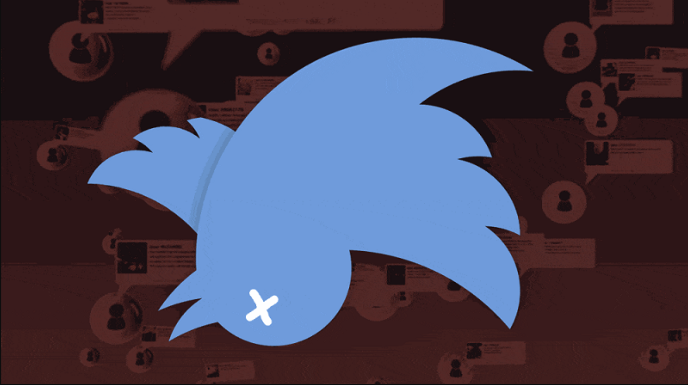

<h1 align="center">
  
</h1>

---

# Détection de tweet suicidaire

## Petit résumé

- Les réseaux sociaux, tels que Twitter, peuvent être un lieu dangereux pour les personnes souffrant de troubles mentaux, en particulier pour ceux qui ont des pensées suicidaires. Les utilisateurs peuvent être exposés à des contenus violents ou déstabilisants, et peuvent également être confrontés à des cyberintimidations ou à des commentaires négatifs sur leur propre contenu.

- Pour aider à combattre ce problème, mettre un place un système permettant de détecter les tweets suicidaires et mettre les personnes concernées en relation avec des professionnels qualifiés. Ce projet pourrait utiliser des techniques d'analyse de texte et d'apprentissage automatique pour détecter les mots clés et les expressions associés au suicide, et pourrait également intégrer des outils de messagerie automatisée pour faciliter la communication avec les professionnels de santé mentale. Enfin, il pourrait être envisagé des partenariats avec des associations et des organismes de prévention du suicide.

## Objectifs

- Détecter les tweets potentiellement suicidaire.
- Deploiment d'un bot twitter mettant en relation la personne avec un professionnel.

## Techno

- Python

## Auteur

- [@Alexandra](https://github.com/AlexandraChuvatin)
- Axel
- [@Owen](https://github.com/owen974)
- [@Pierre](https://github.com/Pierre-Portfolio)